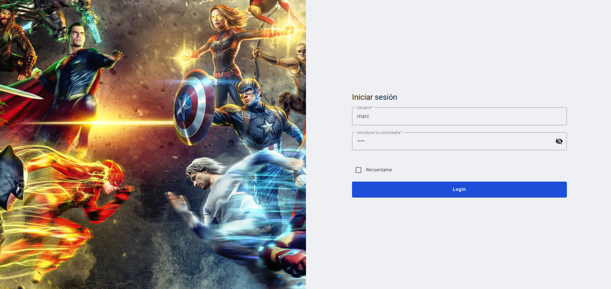
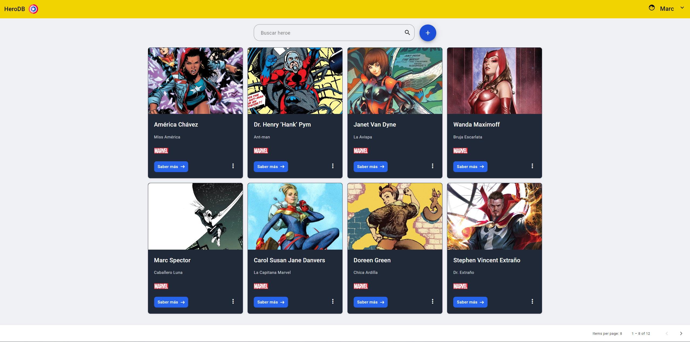
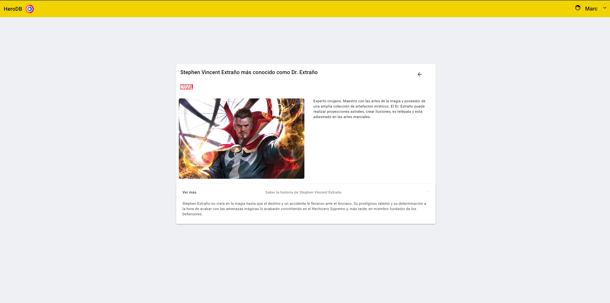
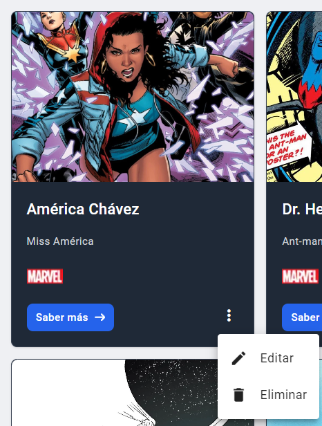
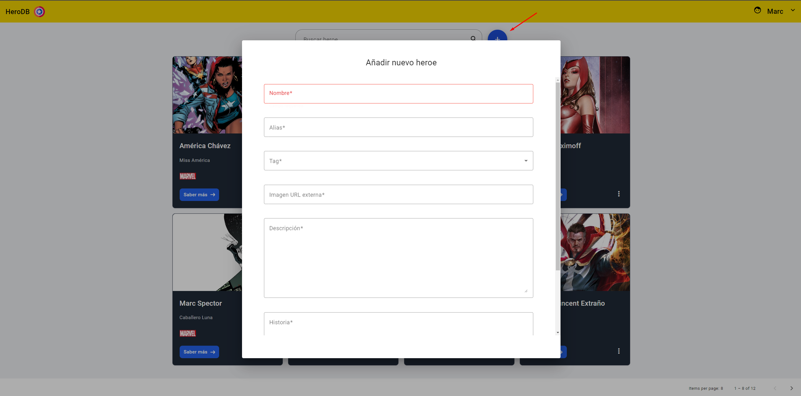
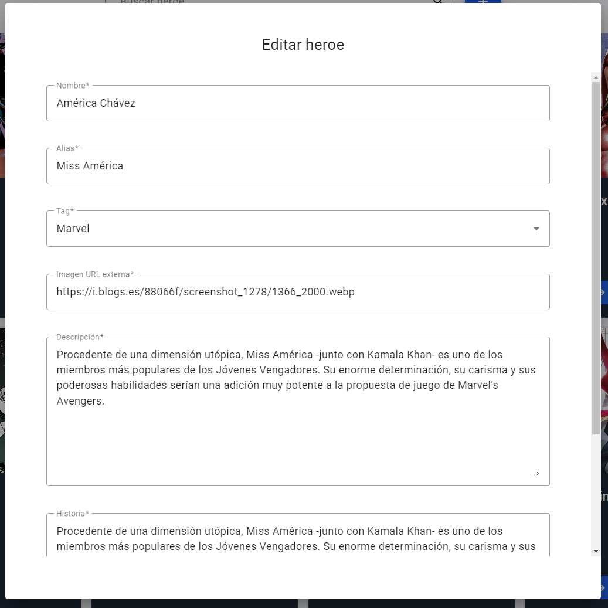
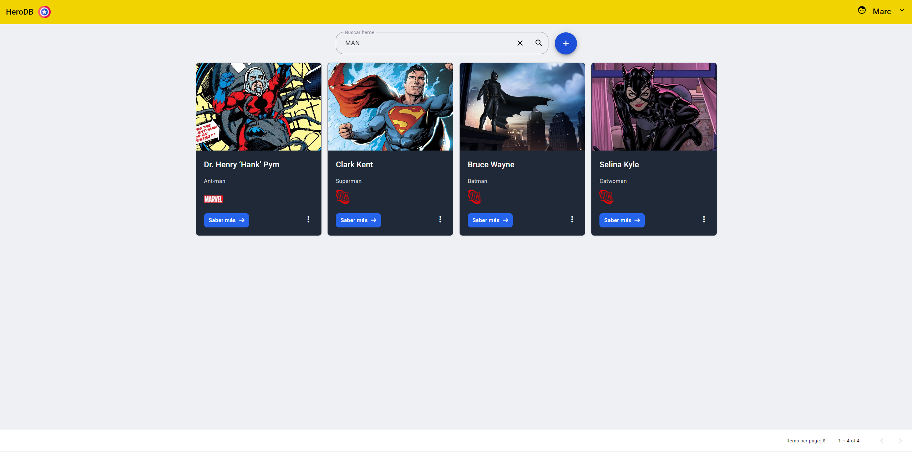

# Hero DB

Aplicación SPA realizada con Angular 17


## Description

Aplicación SPA que permite realizar un mantenimiento/consulta sobre super heróes.

Realizado con:
- Angular 17
- RXJS
- NGXS Store
- Angular Material
- Tailwind
- Json-server
- JEST


## Requirements
- [Node.js](https://nodejs.org/en/) installed on your system.
- [Angular CLI](https://angular.io/cli) installed globally.
- [npm](https://www.npmjs.com) installed globally.

## Run Locally

Clone the project

```bash
  git clone https://github.com/marcam94/prova-a2
```

Go to the project directory

```bash
cd my-project
```

Install dependencies

```bash
npm install
```

Start the server

```bash
ng serve
```

Start the api

```bash
json-server --watch src/app/server/db.json
```

Run tests

```bash
ng test
```

_Check package.json to run scripts_

## Docker

```bash
docker build -t prova-a2 .
```

Start the api

```bash
docker run -p 4201:4200 prova-a2
```


## Features

- Sistema básico de autenticación para controlar las rutas con Guards y con logout
- Consultar todos los héroes
- Mediante acciones y formularios con validaciones poder crear y editar, además de eliminar
- Filtrar heroes por parámetro
- Paginación
- Componentes reutilizables, diálogo, control de errores del formulario, paginator...
- Programación reactiva con RXJS
- Arquitectura limpia
- A través de un state managment poder separar la lógica del componente y utilizar un servicio que ejecuta las acciones del state para comunicarse con una api
- API totalmente mockeada con json-server
- Interceptor para todas las peticiones http que se realicen
- Permite consultar el detalle y obtener más información del super heroe
- Cargar componentes de manera lazy en el routing
- Diseño responsive
- Test unitarios realizados con JEST
- Uso de componentes de angular material y estilos con tailwind
- Aplicación dockerizada

## Screenshots
 
### Login



### Lista



### Detalle



### Acciones



### Crear



### Editar


### Filtrar



